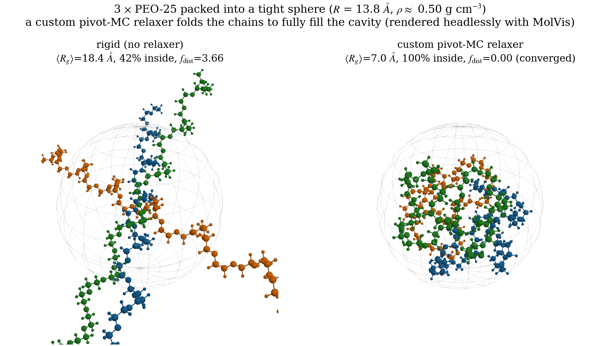
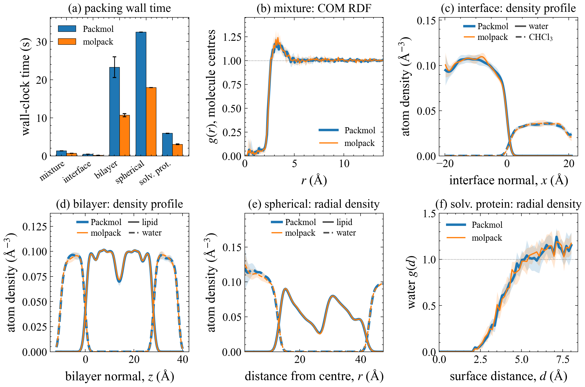
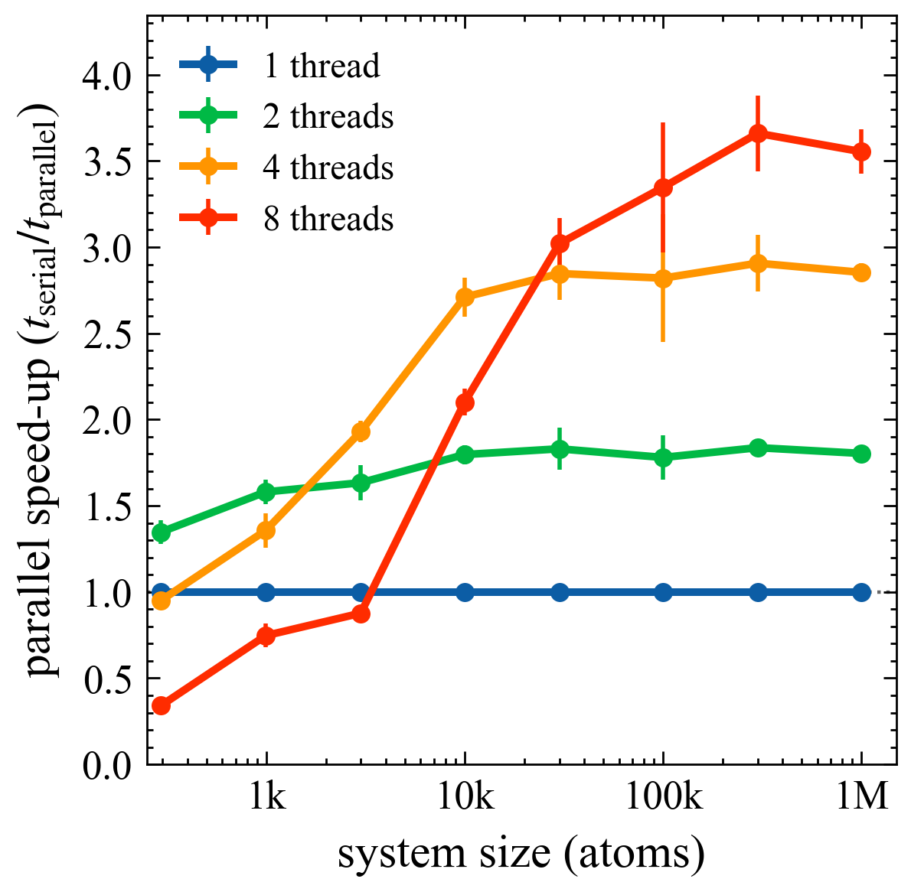

<h1 class="molcrafts-sr-only">molpack</h1>

<div class="molcrafts-manual-home molpack-home" markdown>

<section class="molcrafts-manual-section molpack-system-section" markdown>

<div class="molcrafts-manual-section__header" markdown>

<span class="molcrafts-manual-eyebrow">Core model</span>

## Templates, counts, restraints — then one packing run

molpack is organized around a fixed packing job at every entry point. Provide
molecule templates, copy counts, geometric restraints, and optional fixed
placements or periodic boundaries. The engine returns one packed configuration
with the requested distances and regions satisfied.

</div>

<div class="molpack-system-panel">
<div class="molpack-system-panel__header">
<span>One engine · four surfaces</span>
<strong>Scripts for reproducible jobs · APIs for pipelines · handlers for observation</strong>
</div>
<div class="molpack-system-flow">
<div>
<span>01 · Packmol script</span>
<a href="cli/"><strong>Run `.inp` files with structure, number, inside, fixed, and pbc</strong></a>
</div>
<div>
<span>02 · Python API</span>
<a href="python/"><strong>Build targets from frames, pack in notebooks, keep results in memory</strong></a>
</div>
<div>
<span>03 · Rust API</span>
<a href="rust/"><strong>Native Target and Molpack builders inside your crate</strong></a>
</div>
<div>
<span>04 · Custom handlers</span>
<a href="rust/handlers-relaxers/"><strong>Observe steps, dump trajectories, or stop early</strong></a>
</div>
</div>
</div>

The [Quickstart](getting_started/) packs a first water box. Use
[Packmol scripts](cli/) for checked-in input files, [Python](python/) for
notebooks and pipelines, and [Rust](rust/) when packing is part of a native
application.

</section>

<section class="molcrafts-manual-section molpack-results-section" markdown>

<div class="molcrafts-manual-section__header" markdown>

<span class="molcrafts-manual-eyebrow">Results</span>

## What the engine produces

Canonical Packmol-style workloads — confined solutes, interface distributions,
and multi-target boxes — pack under the same restraint model through every
surface.

</div>

<div class="molpack-result-gallery">
<figure class="molpack-result-figure">

<figcaption>Spherical confinement — mobile solvent held inside a geometric restraint around a fixed solute.</figcaption>
</figure>
<figure class="molpack-result-figure">

<figcaption>Compatibility distributions — collective profile restraints match target density curves at an interface.</figcaption>
</figure>
<figure class="molpack-result-figure molpack-result-figure--wide">

<figcaption>Parallel evaluation — wall time vs system size with the rayon feature enabled on the objective path.</figcaption>
</figure>
</div>

</section>

<section class="molcrafts-manual-section" markdown>

<div class="molcrafts-manual-section__header" markdown>

<span class="molcrafts-manual-eyebrow">In practice</span>

## The same packing model through four entry points

All entry points lower to the same target / count / restraint model. Pick the
surface that matches how the rest of your workflow is written.

</div>

<div class="molcrafts-workflow-list molpack-workflow-list" markdown>

<article markdown>

<div class="molcrafts-workflow-list__meta">01 · Packmol script</div>

### [Run a `.inp` job](cli/)

Use the CLI for reproducible packing jobs that already live as Packmol-style
input files.

```text
structure water.pdb
  number 1000
  inside box 0. 0. 0. 40. 40. 40.
end structure
```

</article>

<article markdown>

<div class="molcrafts-workflow-list__meta">02 · Python API</div>

### [Pack from a notebook or pipeline](python/)

Load or build a frame, create immutable targets, and pass the packed frame to
the writer or analysis code you already use.

```python
water = Target(frame, 100).with_restraint(
    InsideBoxRestraint([0, 0, 0], [40, 40, 40])
)
packed = Molpack().with_seed(42).pack([water])
```

</article>

<article markdown>

<div class="molcrafts-workflow-list__meta">03 · Rust API</div>

### [Embed the engine in a crate](rust/)

Use the native builder API for Rust applications, services, tests, and new
engine features.

```rust
let frame = Molpack::new()
    .with_seed(42)
    .pack(&[water], 200)?;
```

</article>

<article markdown>

<div class="molcrafts-workflow-list__meta">04 · Custom handler</div>

### [Observe or stop a run](rust/handlers-relaxers/)

Handlers receive structured events from the packing loop, so you can log
diagnostics, dump frames, or request early stop without changing the packer.

```rust
impl Handler for WatchFdist {
    fn on_step(&mut self, info: &StepInfo, _sys: &PackContext) {
        eprintln!("fdist={}", info.fdist);
    }
}
```

</article>

</div>

</section>

<section class="molcrafts-manual-section" markdown>

<div class="molcrafts-manual-section__header" markdown>

<span class="molcrafts-manual-eyebrow">Find your page</span>

## The manual

Organized by entry point. **Tutorial** teaches the common packing model.
**Packmol script**, **Python**, and **Rust** cover the public surfaces.
**Handlers** cover observation and early-stop hooks.

</div>

<div class="molcrafts-doc-map molpack-doc-map">
<section>
<h3><a href="install/">Install</a></h3>
<p>CLI binary, crates.io crate, and PyPI wheel — pick a surface and verify it loads.</p>
</section>
<section>
<h3><a href="getting_started/">Quickstart</a></h3>
<p>Pack 100 waters in a 40&nbsp;Å cube end-to-end, then read convergence diagnostics.</p>
</section>
<section>
<h3><a href="cli/">Packmol Script</a></h3>
<p>`.inp` compatibility, formats, path resolution, and CLI examples.</p>
</section>
<section>
<h3><a href="python/">Python API</a></h3>
<p>Targets, restraints, packer options, PBC, examples, and API reference.</p>
</section>
<section>
<h3><a href="rust/">Rust API</a></h3>
<p>Builders, restraint scopes, periodic boxes, handlers, relaxers, examples.</p>
</section>
</div>

</section>

</div>
